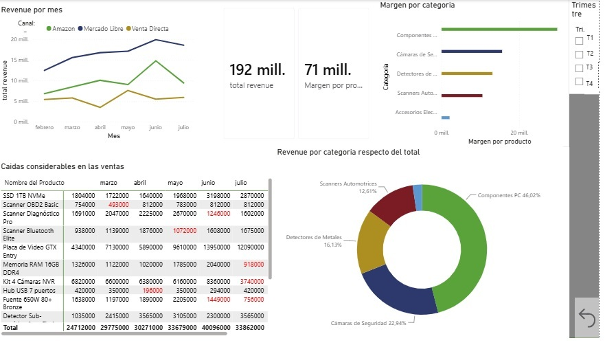

# 📊 Bruno Labarre | Portfolio de Análisis de Datos

¡Hola! Bienvenido a mi portafolio. Soy estudiante de último año de la **Licenciatura en Economía en la Universidad Nacional de Córdoba (UNC)**, Argentina. 

Mi enfoque profesional combina el rigor analítico de la economía con herramientas avanzadas de **Data Science e Inteligencia de Negocios (BI)**. Me apasiona transformar datos complejos en decisiones estratégicas, con un fuerte interés en la modelización econométrica, el análisis financiero y los mercados de capitales (🏅 *3er puesto en el Torneo de Inversores Argentinos DuoMarkets 2025*).

### 🛠️ Stack Tecnológico
*   **Lenguajes y Librerías:** Python (Pandas, NumPy, Scikit-Learn, Statsmodels, Seaborn).
*   **Business Intelligence & Análisis:** Power BI, Microsoft Excel Avanzado (Power Query, Power Pivot, Modelado Financiero).
*   **Especialidades:** Machine Learning (Regresión, Clasificación, Clustering, PCA), Econometría de series temporales, Análisis de Varianza.

---

## 📁 Proyectos Destacados

A continuación, presento mis proyectos de análisis de datos organizados por temática y tecnología. Podés explorar el código y los detalles haciendo clic en las carpetas correspondientes del repositorio.

### 1. [Machine Learning] Comportamiento Digital de Clientes (Regresión y Clasificación)
Análisis del comportamiento de compra digital a partir de datos de navegación, resolviendo dos problemas de modelado estadístico:
*   **Regresión Lineal Múltiple:** Estimación del porcentaje de pedidos digitales. Se optimizó el modelo mediante el análisis de multicolinealidad con el Factor de Inflación de Varianza (VIF) y ajuste de polinomios para evitar el sobreajuste (Trade-off Sesgo-Varianza).
*   **Regresión Logística:** Modelo predictivo para estimar la probabilidad de compras sugeridas. Se abordó el desbalance de clases (90/10) ajustando los pesos y optimizando el hiperparámetro de decisión utilizando la Curva ROC y el índice de Youden.
*   *Herramientas:* `Python`, `Scikit-Learn`, `Statsmodels`.

### 2. [Machine Learning] Análisis Multivariado y Clustering de Empleados
Estudio no supervisado para segmentar perfiles de empleados dentro de una empresa de servicios informáticos.
*   **Reducción de Dimensionalidad (PCA):** Estandarización y extracción de componentes principales para evaluar la varianza explicada. Se manejaron valores atípicos multivariados mediante la Distancia de Mahalanobis.
*   **Clustering (K-Means y Jerárquico):** Segmentación en 4 perfiles utilizando el método de Ward y K-Means. La cantidad óptima de clústeres se validó matemáticamente a través del Método del Codo y los coeficientes de Silueta y Calinski-Harabasz.
*   *Herramientas:* `Python`, `Scikit-Learn`, `SciPy`, `Seaborn`.

### 3. [Business Intelligence] Dashboard de Ventas y Rendimiento
Desarrollo de un panel interactivo para el monitoreo de ingresos y márgenes comerciales de productos tecnológicos (Componentes de PC, Cámaras de Seguridad, Scanners, etc.).
*   **Características:** Seguimiento de *Revenue* total y por categoría, análisis de márgenes por producto y detección automática de caídas considerables en ventas intermensuales para facilitar la toma de decisiones ágil.
*   *Herramientas:* `Power BI`.

---
*Si te interesa mi trabajo o querés charlar sobre datos, economía o mercados, ¡no dudes en contactarme!*
